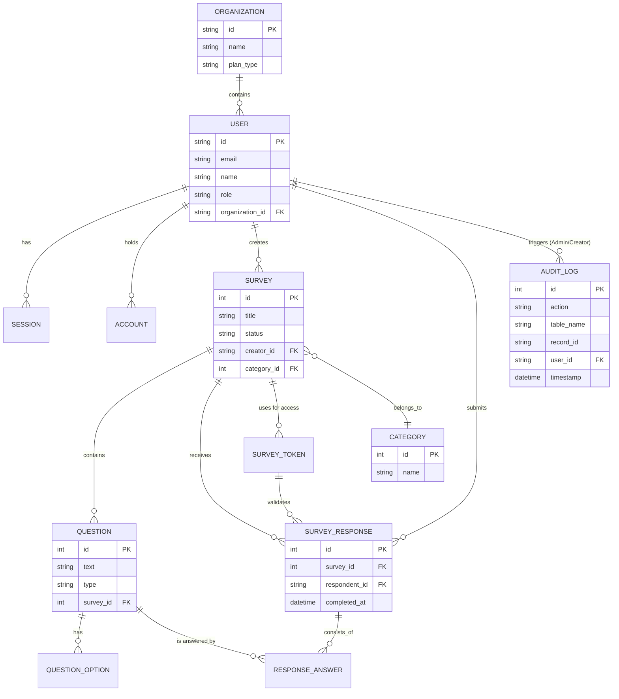

# Entity Relationship Diagram

The following Mermaid diagram represents the logical schema of the **Ask-Now** Survey Application, expanded to 13 entities to meet the project's requirement for complexity (10–15 entities).

### Entities (13 Total):
1.  **User**: System users (Creators and Respondents).
2.  **Session**: Authentication sessions.
3.  **Account**: OAuth and local account details.
4.  **Verification**: Email/token verification records.
5.  **Survey**: Main survey containers.
6.  **Question**: Individual items within a survey.
7.  **QuestionOption**: Choices for multiple-choice or radio questions.
8.  **SurveyResponse**: A single submission of a survey.
9.  **ResponseAnswer**: Specific answers given to specific questions.
10. **SurveyToken**: Access controls for private surveys.
11. **Organization** (Mock): Grouping for users (e.g., Enterprise/Team).
12. **Category** (Mock): Survey classification (e.g., Marketing, HR).
13. **AuditLog** (Mock): Tracks system changes via triggers.
